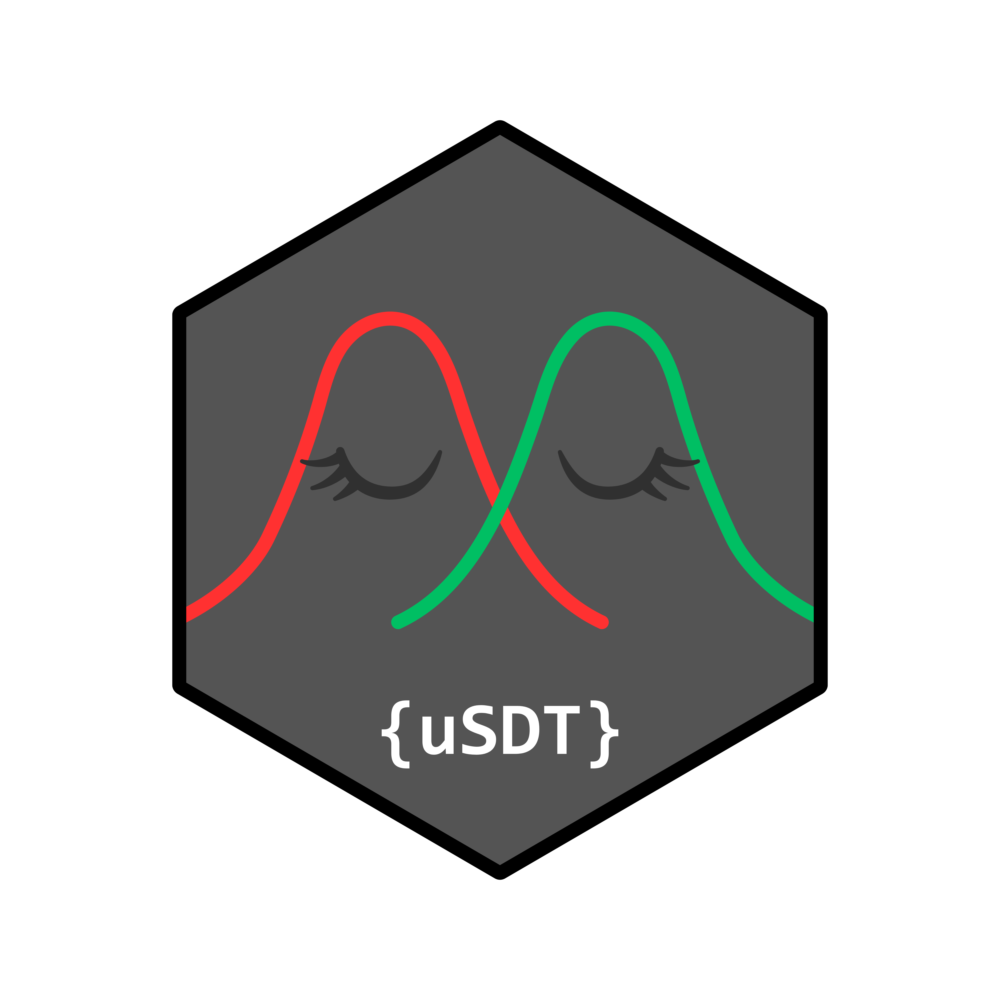

# uSDT 

<!-- badges: start -->
[](https://github.com/RicardoReySaez/uSDT/actions/workflows/R-CMD-check.yaml)
<!-- badges: end -->

`uSDT` estimates hierarchical signal detection theory (SDT) models for
research on unconscious processing. It jointly models sensitivity in paired
direct and indirect measures, allowing researchers to compare both
sensitivities, estimate their latent association, and test indirect sensitivity
when direct sensitivity is zero.

## Installation

Install the development version from GitHub:

```r
install.packages("remotes")
remotes::install_github("RicardoReySaez/uSDT")
```

## Example: Vadillo et al. data

The package includes the two trial-level data frames from Experiment 2 of
Vadillo et al. (2024): `vadillo_awareness` for the direct task and
`vadillo_cuing` for the indirect task.

```r
library(uSDT)

data(vadillo_awareness)
data(vadillo_cuing)

d <- usdt_data_tasks(
  direct = vadillo_awareness,
  indirect = vadillo_cuing,
  subject_col = "subj",
  condition_col = "condition",
  condition_levels = c(signal = "old", noise = "new"),
  response_col = list(direct = "judged.old", indirect = "rt"),
  response_levels = list(
    direct = c(signal = 1, noise = 0),
    indirect = c(signal = "faster", noise = "slower")
  ),
  dichotomize = list(direct = FALSE, indirect = TRUE)
)

fit <- hsdt(d)
summary(fit)
```

Every column, level and format argument takes either one value for both tasks
or one per task as `list(direct = ..., indirect = ...)`, so the two tasks may
differ in the columns they use, in the values those columns take, and in the
format they arrive in.

The source data are from Vadillo, Malejka, and Shanks (2024), *Mapping the
reliability multiverse of contextual cuing*,
[doi:10.1037/xlm0001410](https://doi.org/10.1037/xlm0001410).
