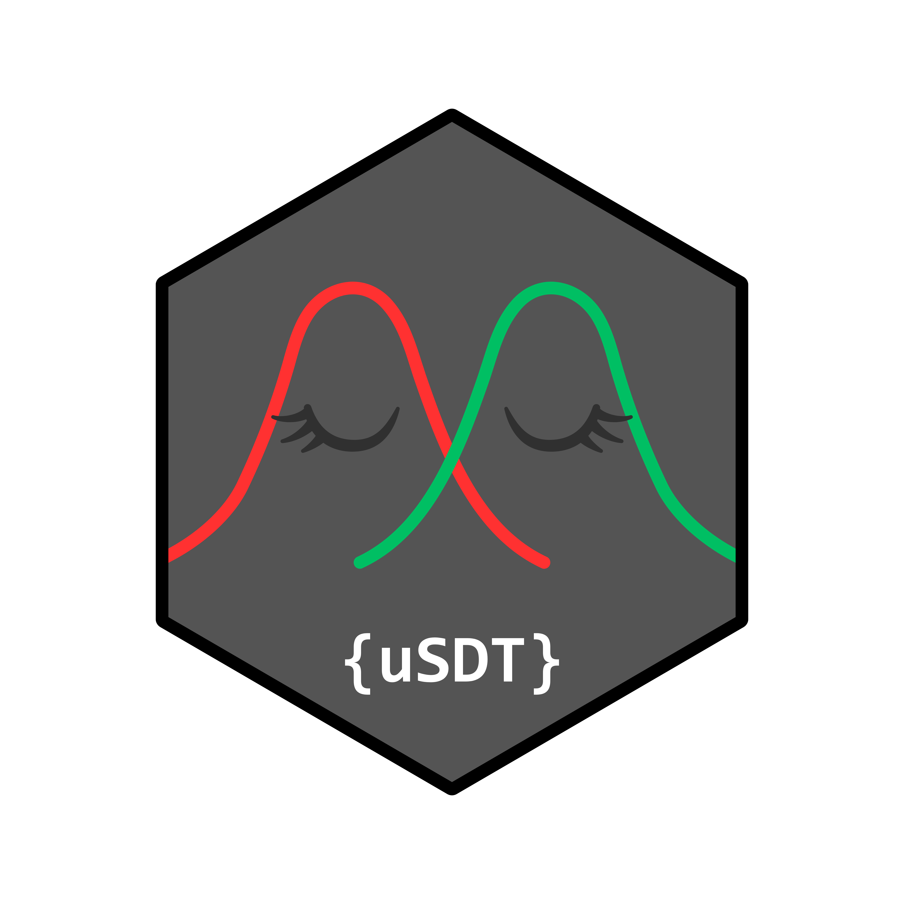

# uSDT 

<!-- badges: start -->
[](https://CRAN.R-project.org/package=uSDT)
[](https://github.com/RicardoReySaez/uSDT/actions/workflows/R-CMD-check.yaml)
[](https://github.com/RicardoReySaez/uSDT/actions/workflows/pkgdown.yaml)
<!-- badges: end -->

`uSDT` estimates hierarchical signal detection theory (SDT) models for
research on unconscious processing. It jointly models sensitivity in paired
direct and indirect measures, allowing researchers to compare both
sensitivities, estimate their latent association, and test indirect sensitivity
when direct sensitivity is zero. The model can be fitted by maximum likelihood
with `lme4` or in a Bayesian framework with Stan, where Bayes factors weigh the
evidence for and against each hypothesis.

## Documentation

The package website is at
**<https://ricardoreysaez.github.io/uSDT/>**. It contains:

- [Getting started](https://ricardoreysaez.github.io/uSDT/articles/uSDT-tutorial.html),
  a tutorial that walks through the whole workflow with real data, from two
  trial-level data frames to the three hypotheses.
- [Bayesian estimation](https://ricardoreysaez.github.io/uSDT/articles/uSDT-bayesian.html),
  the same analysis with priors, posterior summaries and Bayes factors.
- [Reference](https://ricardoreysaez.github.io/uSDT/reference/index.html), the
  help page of every function.
- [Changelog](https://ricardoreysaez.github.io/uSDT/news/index.html), the
  changes in each release.

## Installation

Install the released version from CRAN:

```r
install.packages("uSDT")
```

Or the development version from GitHub:

```r
install.packages("remotes")
remotes::install_github("RicardoReySaez/uSDT")
```

Bayesian estimation also needs `rstan` (with `BH` and `RcppEigen`) from CRAN,
or `cmdstanr` with CmdStan, and a C++ toolchain to compile the model once.

## Example: Vadillo et al. data

The package includes the two trial-level data frames from Experiment 2 of
Vadillo et al. (2025): `vadillo_awareness` for the direct task and
`vadillo_cuing` for the indirect task.

```r
library(uSDT)

data(vadillo_awareness)
data(vadillo_cuing)

d <- usdt_data_tasks(
  direct = vadillo_awareness,
  indirect = vadillo_cuing,
  subject_col = "subj",
  condition_col = "condition",
  condition_levels = c(signal = "old", noise = "new"),
  response_col = list(direct = "judged.old", indirect = "rt"),
  response_levels = list(
    direct = c(signal = 1, noise = 0),
    indirect = c(signal = "faster", noise = "slower")
  ),
  dichotomize = list(direct = FALSE, indirect = TRUE)
)

fit <- hsdt(d)
summary(fit)

# The same model with Stan, and Bayes factors for the three hypotheses
fit_bayes <- hsdt(d, estimation = "bayesian")
summary(fit_bayes)
usdt_bf(fit_bayes)
```

Every column, level and format argument takes either one value for both tasks
or one per task as `list(direct = ..., indirect = ...)`, so the two tasks may
differ in the columns they use, in the values those columns take, and in the
format they arrive in.

The source data are from Vadillo, Malejka, and Shanks (2025), *Mapping the
reliability multiverse of contextual cuing*,
[doi:10.1037/xlm0001410](https://doi.org/10.1037/xlm0001410).
