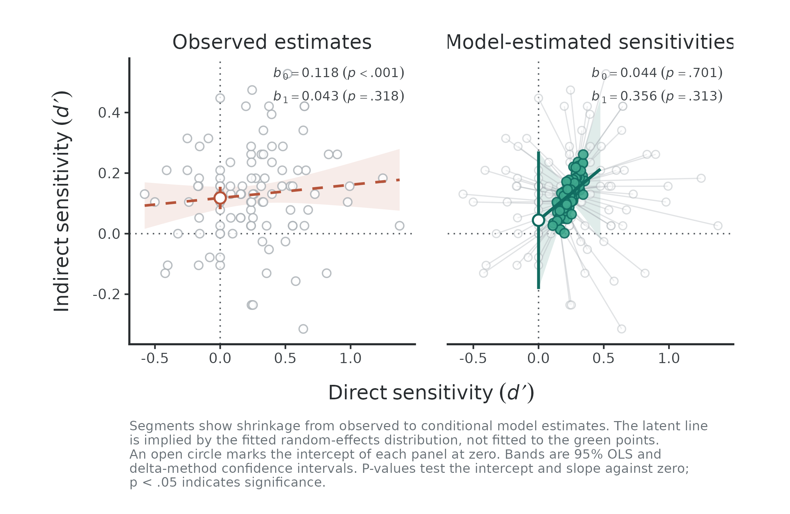
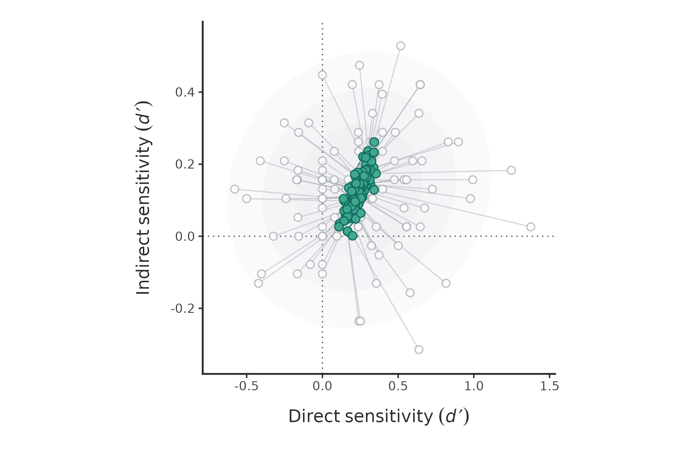
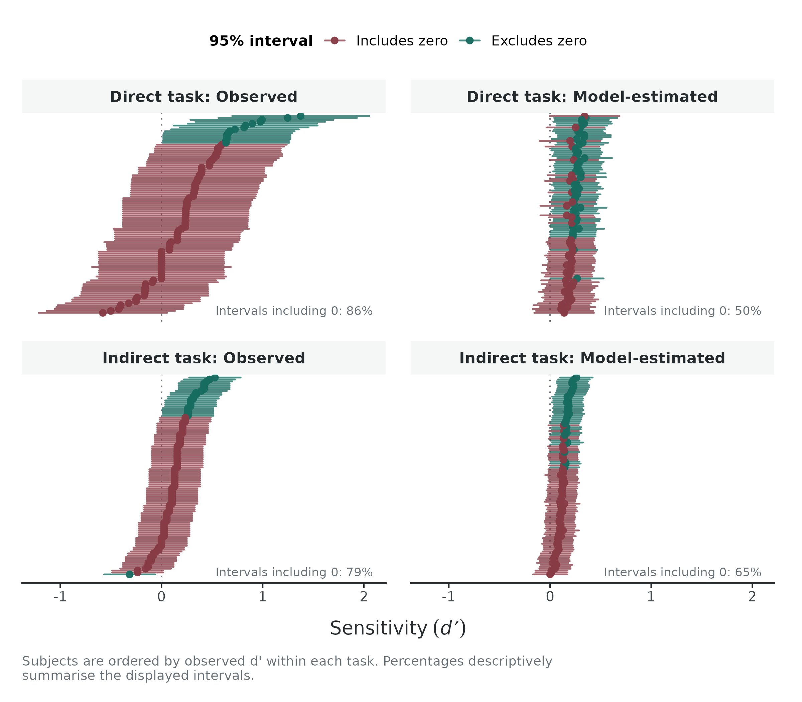
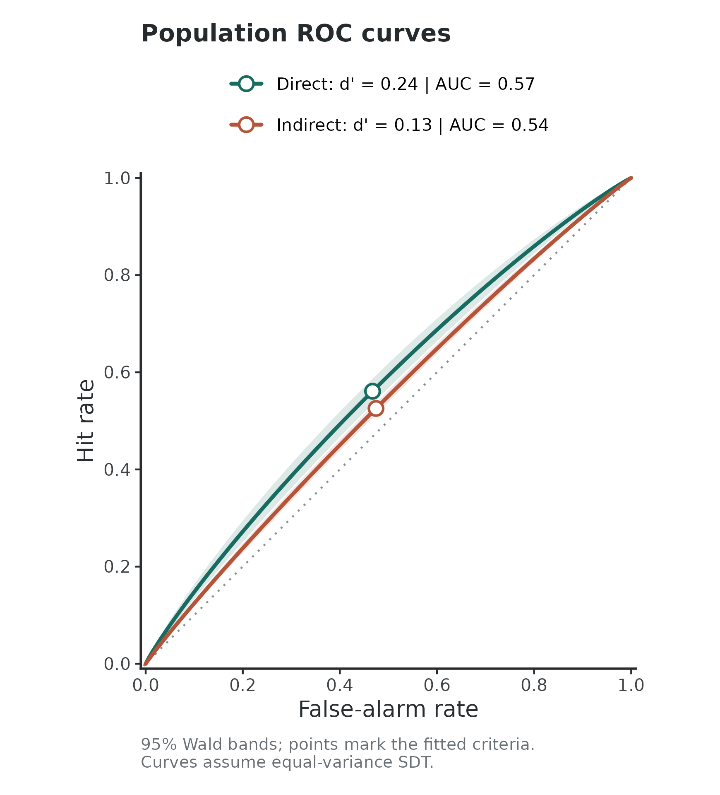
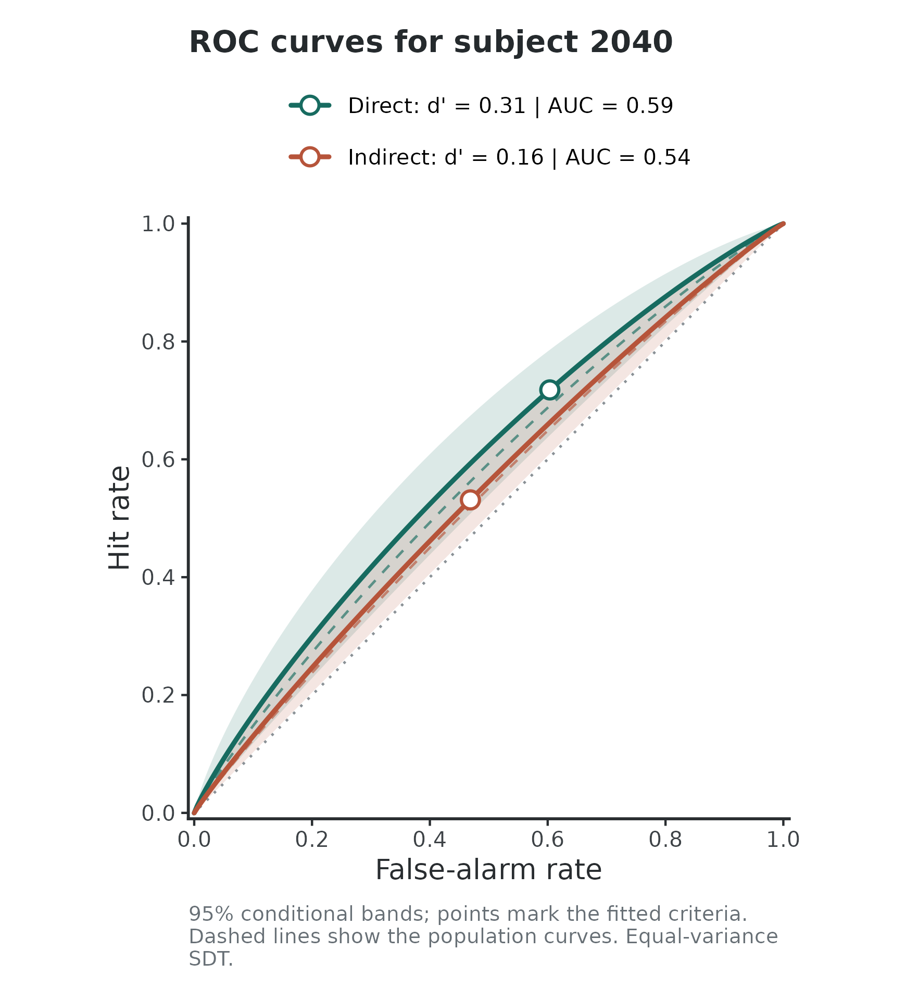

# Fitting a hierarchical SDT model

``` r

library(uSDT)
```

## What is uSDT for?

In many cognitive experiments, we want to know whether a stimulus or
pattern influences behavior even when participants are not aware of it.
To test this, researchers often collect two paired measures from the
same participants: a **direct task** (asking directly whether they
noticed the masked stimulus or statistical regularity) and an **indirect
task** (measuring its behavioral effect, such as priming or faster
response times). The `uSDT` package brings these paired data together
into a hierarchical Signal Detection Theory (SDT) framework, helping you
test key hypotheses about unconscious processing within a single unified
model.

In this tutorial, you will walk through three straightforward steps:

1.  **Prepare your data:** Use
    [`usdt_data_tasks()`](https://ricardoreysaez.github.io/uSDT/reference/usdt_data.md)
    or
    [`usdt_data_long()`](https://ricardoreysaez.github.io/uSDT/reference/usdt_data.md)
    to get your paired measures ready for modeling.
2.  **Fit the model:** Run
    [`hsdt()`](https://ricardoreysaez.github.io/uSDT/reference/hsdt.md)
    to fit the hierarchical SDT model. This model estimates overall task
    sensitivities, subject-specific sensitivity values, and tests three
    key hypotheses about unconscious processing.
3.  **Inspect the results:** Visualize key model estimates with
    [`plot()`](https://rdrr.io/r/graphics/plot.default.html), quantify
    reliability at both the group and subject-specific levels with
    [`usdt_reliability()`](https://ricardoreysaez.github.io/uSDT/reference/usdt_reliability.md),
    or add parametric bootstrap inference with
    [`usdt_boot()`](https://ricardoreysaez.github.io/uSDT/reference/usdt_boot.md)
    if needed.

## The data

To illustrate the workflow, `uSDT` includes trial-level data from a
contextual cuing experiment (Experiment 2 in [Vadillo, Malejka, &
Shanks, 2025](https://doi.org/10.1037/xlm0001410)). The direct task
(`vadillo_awareness`) is an explicit recognition test where participants
judged whether a search display was repeated (`old`) or novel (`new`):

``` r

head(vadillo_awareness)
```

      subj               file trial pattId judgm judged.old condition    offset
    1 2001 y109b_subj1051.mat     1   1001     1          0       old no offset
    2 2001 y109b_subj1051.mat     2   1002     5          1       old no offset
    3 2001 y109b_subj1051.mat     3   3005     4          1       new    offset
    4 2001 y109b_subj1051.mat     4   3006     5          1       new    offset
    5 2001 y109b_subj1051.mat     5   3001     2          0       new no offset
    6 2001 y109b_subj1051.mat     6   1006     4          1       old    offset
      color   set.size
    1 color set size 8
    2   b/w set size 8
    3 color set size 8
    4   b/w set size 8
    5 color set size 8
    6   b/w set size 8

The indirect task (`vadillo_cuing`) measures the visual search itself
through response times. Contextual cuing occurs if participants find
targets faster in repeated (`old`) displays than in `new` ones:

``` r

head(vadillo_cuing)
```

        experiment subj               file trial block epoch pattId acc       rt
    1 Experiment 2 2001 y109b_subj1051.mat     1     1     1   2001   1 1305.352
    2 Experiment 2 2001 y109b_subj1051.mat     2     1     1   1008   1 4027.887
    3 Experiment 2 2001 y109b_subj1051.mat     3     1     1   1007   1 2484.210
    4 Experiment 2 2001 y109b_subj1051.mat     4     1     1   2006   1 1771.315
    5 Experiment 2 2001 y109b_subj1051.mat     5     1     1   1001   1  926.236
    6 Experiment 2 2001 y109b_subj1051.mat     6     1     1   1006   1 1194.542
      condition    offset color    set.size
    1       new no offset color  set size 8
    2       old    offset   b/w set size 16
    3       old    offset color set size 16
    4       new    offset   b/w  set size 8
    5       old no offset color  set size 8
    6       old    offset   b/w  set size 8

Both datasets share the subject identifier column (`subj`) and condition
labels (`old` / `new`). In your own data, the column names and condition
labels do not need to match between tasks, but **participants must share
the same subject IDs across both datasets**.

## Preparing the data

[`usdt_data_tasks()`](https://ricardoreysaez.github.io/uSDT/reference/usdt_data.md)
combines the two tasks into a single paired dataset. You specify the
subject, condition, and response columns, and map their levels to signal
and noise roles.

Whenever an argument is shared across both tasks, you can pass **a
single value** (like `subject_col = "subj"`). When tasks differ, provide
**a list per task** using `list(direct = ..., indirect = ...)`:

``` r

data_usdt <- usdt_data_tasks(
  # One data frame per task
  direct   = vadillo_awareness,
  indirect = vadillo_cuing,

  # Shared subject column
  subject_col = "subj",

  # Condition mapping (shared column name and labels here)
  condition_col    = "condition",
  condition_levels = c(signal = "old", noise = "new"),

  # Response columns differ: judgements vs continuous response times
  response_col = list(direct = "judged.old", indirect = "rt"),

  # How responses map to signal vs noise
  response_levels = list(
    direct   = c(signal = 1, noise = 0),
    indirect = c(signal = "faster", noise = "slower")
  ),

  # Dichotomize continuous response times using a median split
  dichotomize = list(direct = FALSE, indirect = TRUE),
  
  # Contrast coding scheme across conditions (deviation by-default)
  coding = "deviation"
)
```

### Condition coding: deviation vs treatment

The `coding` argument only affects what the response criterion (also
called “bias parameter”) represents in the model. Task sensitivity (d')
remains identical under both schemes:

- **`"deviation"` (default):** Codes signal as +0.5 and noise as -0.5.
  The intercept reflects the overall response bias centered between both
  stimulus distributions.
- **`"treatment"`:** Codes noise as 0 and signal as 1. The intercept
  reflects the criterion relative only to the baseline (noise)
  condition.

By default, `uSDT` uses deviation coding.

### How the median split works

Setting `dichotomize = list(direct = FALSE, indirect = TRUE)` converts
continuous RTs into binary responses via a median split computed within
each subject across all trials, following the approach proposed by
[Meyen et al. (2022)](https://doi.org/10.1037/xge0001065). In this case:

- RTs below the subject’s median count as `"faster"` (signal responses).
- A `"hit"` is an old display searched faster than the median, while a
  `"false alarm"` is a new display searched faster than the median.

By design, splitting exactly at the median balances fast and slow
responses across trials. **Under deviation coding**, this balance
centers the indirect decision criterion at zero (c \approx 0). Because
of this,
[`hsdt()`](https://ricardoreysaez.github.io/uSDT/reference/hsdt.md)
fixes the indirect criterion to zero by default whenever the mean
absolute subject criterion is below 0.02 (you can override this with
`fix_criteria = "none"`).

### Inspecting the prepared data

Printing the object gives a quick sanity check before fitting the model:

``` r

data_usdt
```

    ── Data summary ──────────────────────────────────────────────────────────────── 

      Input:          2 data frames (usdt_data_tasks)
      Subjects:       104 (104 in both tasks, 0 in one only)
      Trials:         46,592 -> 416 aggregated rows (4 per subject)
      Coding:         deviation (condition coded -0.5 / +0.5; intercept estimates -c)
      Parameters:     7 (3 fixed effects, 4 (co)variance components)

    ── Variable mapping ────────────────────────────────────────────────────────────

      Variable       Task       Column          Signal        Noise
      subject        Direct     subj            -             -
                     Indirect   subj            -             -
      condition      Direct     condition       old           new
                     Indirect   condition       old           new
      response       Direct     judged.old      1             0
                     Indirect   rt              faster        slower  [Meyen split]

    ── Descriptives: median [min, max] across subjects ─────────────────────────────

      Task       Trials/cell                  HR                 FAR   d' (method-of-moments)
      Direct              32    .56 [ .28,  .88]    .47 [ .12,  .78]    0.24 [-0.58,  1.38]
      Indirect           192    .53 [ .44,  .60]    .47 [ .40,  .56]    0.13 [-0.31,  0.53]

      No cells at floor or ceiling.

Take a moment to inspect the three sections of this summary:

- **Data summary:** Confirms subject overlap (e.g., all 104 participants
  completed both tasks) and shows how raw trials were aggregated into 4
  condition-by-response cells per subject. It also reminds you of the
  chosen `coding`.
- **Variable mapping:** Verifies that your column names and signal/noise
  assignments match your experimental expectations (including the
  `[Meyen split]` flag on the indirect RTs).
- **Descriptives:** Reports the median and range of hit rates (HR),
  false alarm rates (FAR), and descriptive d' across subjects. It also
  warns if any participants hit floor or ceiling rates, which helps
  catch data issues early.

## Fitting the model

Once the data are prepared,
[`hsdt()`](https://ricardoreysaez.github.io/uSDT/reference/hsdt.md) fits
the hierarchical SDT model via a binomial probit generalized linear
mixed model (implemented with `lme4`). The model estimates the average
sensitivity (d') for each task along with between-subjects individual
differences. You can inspect the parameter estimates, random-effects,
and hypothesis tests using
[`summary()`](https://rdrr.io/r/base/summary.html):

``` r

# Fit hierarchical SDT model
fit_uSDT <- hsdt(data_usdt)

# Check model results
summary(fit_uSDT)
```

    ── Model summary ─────────────────────────────────────────────────────────────── 

      Subjects:       104
      Observations:   416 aggregated rows (46,592 trials)
      Family:         binomial (probit)
      Coding:         deviation
      Criteria:       Direct estimated, Indirect fixed to 0 (Meyen split, mean |c| = 0.0000)
      Estimation:     lme4::glmer (bobyqa)
      Convergence:    TRUE

    ── Fixed effects ───────────────────────────────────────────────────────────────

      Parameter      Task       Estimate       SE  95% CI                   z   p-value
      criterion      Direct      -0.0357   0.0289  [ -0.092,  0.021]    -1.24      .215
      d'             Direct       0.2354   0.0335  [  0.170,  0.301]     7.03     <.001
      d'             Indirect     0.1283   0.0153  [  0.098,  0.158]     8.41     <.001

    ── Random effects ──────────────────────────────────────────────────────────────

      Parameter      Task       Estimate       SE  95% CI            
      sd(criterion)  Direct       0.2473   0.0246  [  0.203,  0.301]
      sd(d')         Direct       0.1219   0.0666  [  0.042,  0.356]
      sd(d')         Indirect     0.0883   0.0190  [  0.058,  0.135]
      cor(d')        both         0.4912   0.5190  [ -0.666,  0.954]

    ── Hypotheses ──────────────────────────────────────────────────────────────────

    H1: Group-level sensitivity difference (Δd' = Direct d' - Indirect d')
      Parameter       Estimate       SE  95% CI                   z   p-value
      Δd' (D - I)      0.1071   0.0354  [  0.038,  0.176]     3.03      .002

    H2: Correlation between sensitivities across tasks
      Parameter       Estimate       SE  95% CI                   z   p-value
      rho               0.4912   0.5190  [ -0.666,  0.954]     1.01      .313

    H3: Latent regression of Indirect d' on Direct d'
      Parameter       Estimate       SE  95% CI                   z   p-value
      Intercept         0.0445   0.1160  [ -0.183,  0.272]     0.38      .701
      Slope             0.3561   0.4870  [ -0.599,  1.311]     1.01      .313

    ── Notes ───────────────────────────────────────────────────────────────────────

      Use usdt_boot(fit, nsim = 1000, ncores = 4) for bootstrap CIs.

### Understanding fixed and random effects

The summary breaks the model into two primary structural components
before presenting hypothesis tests:

- **Fixed effects (group-level means):** The fixed estimates describe
  average task performance across all participants. Here, mean
  sensitivity is reliably above zero in both the direct task
  (`d' = 0.24`, p \< .001) and the indirect task (`d' = 0.13`, p \<
  .001), indicating above-chance recognition and a significant
  contextual cuing effect overall. The direct criterion (`-0.04`, p =
  .215) shows no substantial group-level response bias. As determined
  during data preparation, the indirect criterion is fixed to zero and
  therefore omitted from estimation.
- **Random effects (individual differences):** These parameters capture
  between-subject variability around the group means. The standard
  deviations (`sd(d')`) reflect individual variability in sensitivity
  for both tasks. The correlation parameter (`cor(d') = 0.49`) estimates
  the latent association between direct and indirect sensitivity across
  participants, though its wide confidence interval indicates
  considerable uncertainty around this estimate.

### Testing unconscious processing: The three hypotheses

The bottom section of the model output tests three complementary
questions often raised in the unconscious processing literature. You can
inspect these results directly in the main summary or extract them as a
standalone table with `fit_uSDT$tests`.

#### H1: Group-level sensitivity difference (\Delta d')

The first hypothesis asks whether the two tasks differ in their average
sensitivity. In unconscious perception paradigms, finding that indirect
sensitivity clearly exceeds direct sensitivity (\Delta d' \< 0) is
sometimes taken as an indirect-task advantage—suggesting that the
indirect measure picks up signal that conscious report misses.

In our sample, the difference is positive and significantly different
from zero (\Delta d' = 0.11, 95% CI \[0.04, 0.18\], p = .002). Direct
recognition was significantly stronger than indirect contextual cuing,
so we find no evidence of an indirect-task advantage.

#### H2: Latent correlation between tasks (\rho)

The second test examines individual differences: do participants with
stronger conscious recognition also display larger cuing effects? In
some theoretical accounts, an indirect effect that operates
independently of conscious awareness would predict a weak or near-zero
correlation between both measures.

Here, the estimated latent correlation is positive (\rho = 0.49), but it
comes with considerable estimation uncertainty (95% CI \[-0.67, 0.95\],
p = .313). Because the confidence interval is so wide, failing to reach
significance here simply reflects high measurement noise around the
correlation, rather than positive evidence that the two processes are
dissociated. We will see this more clearly later when evaluating
task-specific reliability.

#### H3: Latent regression (Indirect d' on Direct d')

The third test evaluates what happens at the boundary of awareness via a
latent regression. Specifically, the intercept (\beta_0) estimates what
level of indirect sensitivity we would expect when direct sensitivity is
exactly zero (d'\_{\text{Direct}} = 0). If this intercept is
significantly different from zero and positive, it suggests that
participants would still show a behavioral cuing effect even without any
conscious awareness of the stimuli.

In this experiment, the regression slope is positive (\beta_1 = 0.36, p
= .313), and the estimated intercept is slightly above zero (\beta_0 =
0.04). However, its confidence interval easily covers zero (\[-0.18,
0.27\], p = .701), showing no evidence of unconscious processing in the
absence of awareness.

## Reliability of individual differences

Evaluating unconscious processing through individual differences is
delicate because measurement error does not just add noise, it
systematically biases theoretical conclusions when ignored.

It is widely know that low reliability attenuates correlations toward
zero ([Spearman, 1904](https://doi.org/10.2307/1412159)), making direct
and indirect tasks appear falsely independent. It also flattens the
regression slope and artificially inflates the intercept, creating the
illusion that indirect processing persists without awareness. In
practice, measurement error actively conspires to produce evidence of
unconscious processing. **Fortunately, hierarchical SDT models test
these hypotheses at the latent level, naturally accounting for
measurement error regardless of the specific reliability values.**

Even though
[`hsdt()`](https://ricardoreysaez.github.io/uSDT/reference/hsdt.md)
protects the tests against this bias, estimating reliability remains
useful for understanding how well individual differences were measured.
[`usdt_reliability()`](https://ricardoreysaez.github.io/uSDT/reference/usdt_reliability.md)
estimates the reliability of each experimental effect treated as an
individual-differences dimension:

``` r

usdt_reliability(fit_uSDT)
```

    ── Reliability summary ───────────────────────────────────────────────────────── 

      Task         Subjects Group-level estimate   By-subject estimate median [min, max]
      Direct            104                 .129   .130 [.119, .131]
      Indirect          104                 .323   .323 [.322, .323]

In this sample, the group-level reliability is low for both the direct
task (`.13`) and the indirect task (`.32`). Because individual
differences in both measures carry substantial trial noise, the model
cannot estimate between-task associations with precision. This modest
reliability directly explains the wide confidence intervals we observed
earlier for the latent correlation (\rho) and the regression intercept.

In addition to the overall group summary, you can inspect
subject-specific reliability estimates. The `$subjects` element returns
a data frame with individual values:

``` r

print(head(usdt_reliability(fit_uSDT)$subjects), digits = 3)
```

        task subj dprime variance reliability
    1 Direct 2001  0.271   0.0990       0.130
    2 Direct 2002  0.249   0.1043       0.125
    3 Direct 2003  0.217   0.1002       0.129
    4 Direct 2004  0.318   0.0991       0.130
    5 Direct 2005  0.144   0.1004       0.129
    6 Direct 2006  0.173   0.0993       0.130

## Visualizing the model

### The latent regression

To make the consequences of measurement error intuitive,
[`plot()`](https://rdrr.io/r/graphics/plot.default.html) compares a
standard regression on observed sensitivities against the model’s latent
regression side by side:

``` r

plot(fit_uSDT)
```



The contrast between the two panels illustrates the core problem:

- **Observed estimates (left panel):** Regressing raw indirect d' on raw
  direct d' ignores measurement error. Unreliability severely flattens
  the slope (b_1 = 0.043) and artificially pushes the intercept upward
  (b_0 = 0.118, p \< .001). An applied researcher relying on standard
  regression would mistakenly conclude that there is compelling evidence
  for unconscious processing at d'\_{\text{Direct}} = 0.
- **Model-estimated sensitivities (right panel):** The hierarchical
  model corrects for trial-level noise. Grey segments show shrinkage
  from raw d' to model-implied d' values (green points). Accounting for
  unreliability steepens the latent slope (b_1 = 0.356) and pulls the
  intercept down to near zero (b_0 = 0.044, p = .701, marked at the
  vertical dotted line).

### Shrinkage

To inspect how the model pulls individual estimates toward the group
distribution, set `type = "shrinkage"`, where grey circles show raw d',
while green points show the model-implied d' estimates.

``` r

plot(fit_uSDT, type = "shrinkage")
```



### Subject intervals

To look at individual sensitivities relative to zero across tasks, use a
caterpillar plot:

``` r

plot(fit_uSDT, type = "caterpillar")
```



The left panels show observed d' values and their 95% confidence
intervals, whereas the right panels show model-implied d' values and
their 95% confidence intervals. Green intervals exclude zero, whereas
brown intervals cross the dotted vertical line.

In the raw data, noisy trial estimates leave most individual intervals
crossing zero (91% in direct, 79% in indirect). Pooling information in
the hierarchical model shrinks extreme point estimates toward the group
mean and tightens their uncertainty, reducing the share of intervals
crossing zero.

### ROC curves

To view task performance within standard Signal Detection Theory space,
set `type = "roc"`:

``` r

plot(fit_uSDT, type = "roc")
```



The plot draws model-implied, equal-variance ROC curves for each task
based on the group-level parameter estimates. The circular markers
indicate the operating point determined by the fitted response criterion
(c), accompanied by their 95% Wald bands and Area Under the Curve (AUC)
values. You can also inspect individual participants by supplying a
`subject_id`:

``` r

plot(fit_uSDT, type = "roc", subject_id = 2040)
```



The solid curves and points reflect that participant’s partially pooled
estimates, while the dashed lines keep the population curves in the
background for visual reference.

## Where to go from here

### Parametric bootstrap inference

Analytical standard errors and Wald intervals can become unreliable when
variance components approach zero or correlations sit near boundaries
(\pm 1). For more robust inference,
[`usdt_boot()`](https://ricardoreysaez.github.io/uSDT/reference/usdt_boot.md)
implements a parametric bootstrap that simulates new data from the
fitted model and refits each replicate.

``` r

fit_boot <- usdt_boot(fit_uSDT, nsim = 1000, ncores = 4, seed = 2026)
summary(fit_boot)
fit_boot$tests
```

A few practical considerations when bootstrapping:

- **Convergence and filtering:** The function automatically discards
  non-converged refits, tracking diagnostic flags in the output. A
  minimum of 500 valid bootstrap replicates is recommended for
  trustworthy confidence intervals.
- **Dichotomized designs:** The simulation generates binary trial
  responses at the original cell sizes without repeating upstream steps
  like response-time median splits.
- **Information limits:** While bootstrapping resolves boundary issues
  in Wald approximations, it remains conditional on the model and cannot
  compensate for an inherently underpowered design.

### Long-format datasets

If your direct and indirect data already reside in a single data frame
with a task column, you can prepare them directly using
[`usdt_data_long()`](https://ricardoreysaez.github.io/uSDT/reference/usdt_data.md)
by specifying `task_col` and `task_levels`.

## References

Meyen, S., Zerweck, I. A., Amado, C., von Luxburg, U., & Franz, V. H.
(2022). Advancing research on unconscious priming: When can scientists
claim an indirect task advantage? *Journal of Experimental Psychology:
General*, 151(1), 65-81. <https://doi.org/10.1037/xge0001065>

Spearman, C. (1904). The proof and measurement of association between
two things. *The American Journal of Psychology, 15*(1), 72–101.
<https://doi.org/10.2307/1412159>

Vadillo, M. A., Malejka, S., & Shanks, D. R. (2025). Mapping the
reliability multiverse of contextual cuing. *Journal of Experimental
Psychology: Learning, Memory, and Cognition*, 51(6), 910-927.
<https://doi.org/10.1037/xlm0001410>
