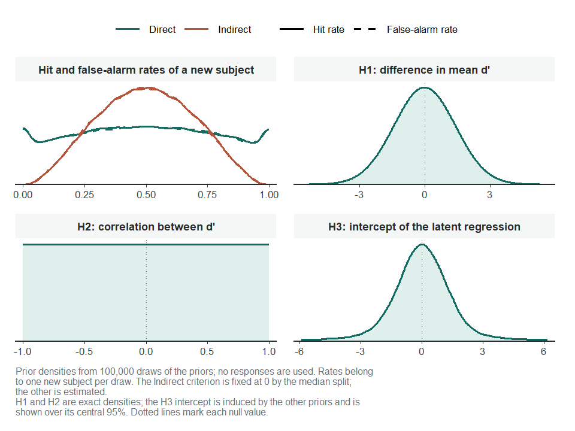
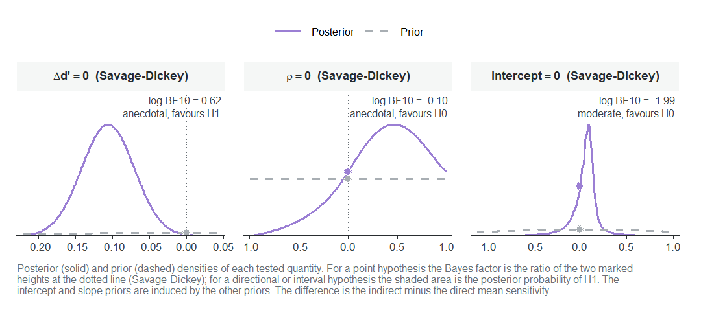
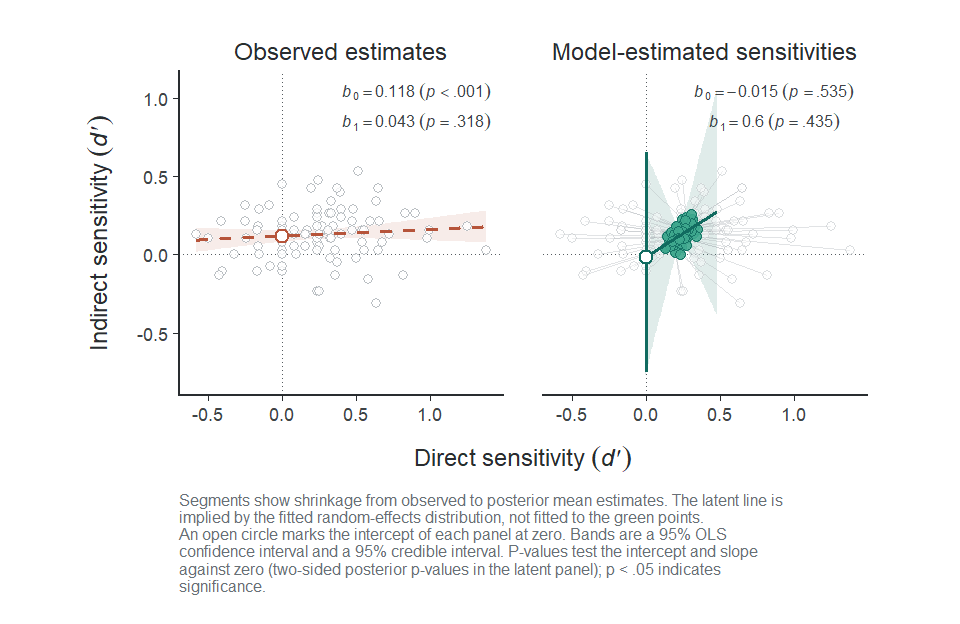
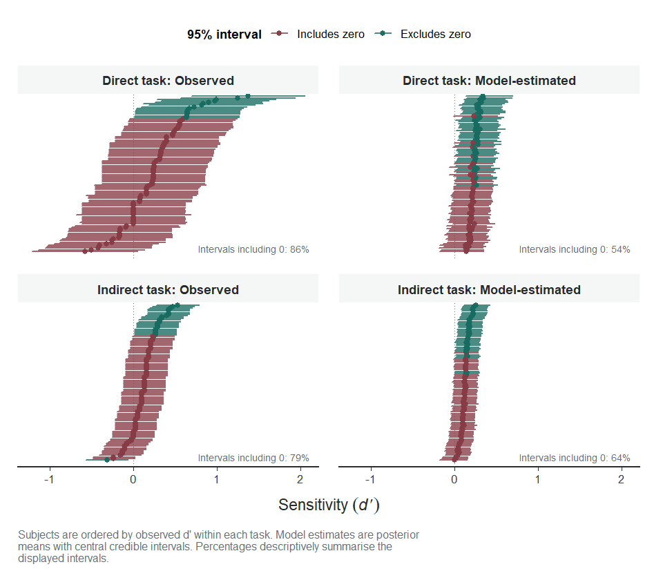

<!-- This vignette is precomputed, because fitting the Stan model takes too
long for CRAN. Edit uSDT-bayesian.Rmd.orig and, from the vignettes folder,
run knitr::knit("uSDT-bayesian.Rmd.orig", "uSDT-bayesian.Rmd"). -->


``` r
library(uSDT)
```

The [tutorial](uSDT-tutorial.html) fits the hierarchical SDT model by maximum
likelihood. This article fits the same model to the same contextual cuing data
in a Bayesian framework. The data, the model and the three hypotheses do not
change. What changes is that you place **priors** on the parameters, Stan
draws from the **posterior**, and you can weigh each hypothesis with **Bayes
factors**.

Bayesian estimation needs either `rstan` (together with `BH` and `RcppEigen`)
or `cmdstanr`. The Stan model is compiled the first time you use it, which
needs a C++ toolchain and takes a minute or two, and it is cached for later
sessions.

## The data

We use the paired data exactly as the tutorial prepares them:


``` r
data_usdt <- usdt_data_tasks(
  direct   = vadillo_awareness,
  indirect = vadillo_cuing,
  subject_col      = "subj",
  condition_col    = "condition",
  condition_levels = c(signal = "old", noise = "new"),
  response_col     = list(direct = "judged.old", indirect = "rt"),
  response_levels  = list(direct   = c(signal = 1, noise = 0),
                          indirect = c(signal = "faster", noise = "slower")),
  dichotomize      = list(direct = FALSE, indirect = TRUE)
)
```

## Choosing the priors

[`usdt_priors()`](../reference/usdt_priors.html) specifies the priors. Each
prior is a string in Stan notation, and the defaults are weakly informative on
the probit scale:


``` r
priors <- usdt_priors()
priors
```

```
── Priors ────────────────────────────────────────────────────────────────────── 

  Parameter    Task       Prior
  mean d'      direct     normal(0, 1)
  mean d'      indirect   normal(0, 1)
  sd(d')       direct     student_t(4, 0, 0.5)
  sd(d')       indirect   student_t(4, 0, 0.5)
  cor(d')      both       scaled_beta(1, 1)
  mean c       direct     normal(0, 0.5)
  mean c       indirect   normal(0, 0.5)
  sd(c)        direct     student_t(4, 0, 0.5)
  sd(c)        indirect   student_t(4, 0, 0.5)
  cor(c)       both       scaled_beta(1, 1)
  sd(signal)   direct     lognormal(0, 0.5)
  sd(signal)   indirect   lognormal(0, 0.5)

  Standard deviation priors are truncated at zero. cor(c) applies when
  both criteria are estimated, and sd(signal) under unequal variances.
```

- **Means of $d'$ and of the criterion:** normal priors centred at zero,
  `normal(0, 1)` for $d'$ and `normal(0, 0.5)` for $c$.
- **Between-subject standard deviations:** Student-$t$ priors truncated at
  zero, `student_t(4, 0, 0.5)`.
- **Correlations:** `scaled_beta(1, 1)`, a uniform prior on $(-1, 1)$.

The model only uses the priors of the parameters it estimates. Here the
median split fixes the indirect criterion at zero and both tasks have equal
variances, so the indirect criterion, the criterion correlation and the signal
standard deviations play no role.

### Checking what the priors imply

Before fitting anything, `plot()` simulates the priors to show what they say
about the data and the hypotheses:


``` r
plot(priors, data = data_usdt)
```

<div class="figure" style="text-align: center">

<p class="caption">plot of chunk prior-check</p>
</div>

- **Hit and false-alarm rates (top left):** the rates of a new subject spread
  over the whole $(0, 1)$ range without piling up at either end. The indirect
  rates are more concentrated because the median split fixes their criterion.
- **H1 and H2 (top right, bottom left):** the exact priors of $\Delta d'$, a
  normal centred at zero, and of $\rho$, uniform.
- **H3 (bottom right):** the intercept of the latent regression has no prior
  of its own. Its prior follows from those of the means, standard deviations
  and correlation, and is symmetric around zero with heavy tails.

To change a prior, pass its new value to `usdt_priors()`, either for both
tasks or per task, and the result to `hsdt()`:


``` r
priors_narrow <- usdt_priors(
  dprime = list(direct = "normal(0, 1)", indirect = "normal(0, 0.5)")
)
hsdt(data_usdt, estimation = "bayesian", priors = priors_narrow)
```

## Fitting the model

Setting `estimation = "bayesian"` in [`hsdt()`](../reference/hsdt.html) fits
the model with Stan:


``` r
fit_bayes <- hsdt(data_usdt, estimation = "bayesian", seed = 2026)
── Fitting the Bayesian hierarchical SDT model ──────────────────────── rstan ──
ℹ 4 chains of 5000 draws after 1000 warmup iterations, 4 at a time.
✔ Sampled 4 chains in 25.5s.
✔ No divergent transitions.
✔ No transition reached the maximum tree depth (10).
✔ Largest R-hat 1.004, below 1.01.
✔ Smallest effective sample size 1905, above 400.
```

By default, four chains keep 5,000 draws each after 1,000 warmup iterations,
and up to four of them run at once, leaving two cores of your machine free.
In the console, a progress bar shows the warmup and sampling phases while they
run. When they finish, the model reports its convergence checks:

- **Divergent transitions and maximum tree depth:** signs that the sampler
  could not explore the posterior well.
- **R-hat:** values above 1.01 suggest that the chains have not mixed.
- **Effective sample size:** values below 400 suggest too few independent
  draws for stable summaries.

Here all four checks pass. Sampling options such as `chains`, `iter`,
`warmup`, `cores`, `seed` and `control` go through `...`, and
`backend = "cmdstanr"` uses CmdStan instead of rstan.

The summary has the same structure as the frequentist one:


``` r
summary(fit_bayes)
```

```
── Model summary ─────────────────────────────────────────────────────────────── 

  Subjects:       104
  Observations:   416 aggregated rows (46,592 trials)
  Family:         binomial (probit), equal variances
  Criteria:       Direct estimated, Indirect fixed to 0 (Meyen split, mean |c| = 0.0000)
  Estimation:     Stan via rstan, 4 chains x 5,000 draws (warmup 1,000)
  Diagnostics:    max R-hat 1.004, min ESS 1,905, 0 divergent

── Fixed effects ───────────────────────────────────────────────────────────────

  Parameter      Task           Mean       SD  95% CrI             R-hat     ESS
  criterion      Direct      -0.0357   0.0291  [ -0.093,  0.022]   1.001   6,410
  d'             Direct       0.2344   0.0337  [  0.169,  0.301]   1.000  24,244
  d'             Indirect     0.1282   0.0153  [  0.098,  0.158]   1.000  17,150

── Random effects ──────────────────────────────────────────────────────────────

  Parameter      Task           Mean       SD  95% CrI             R-hat     ESS
  sd(criterion)  Direct       0.2518   0.0252  [  0.205,  0.305]   1.000   7,830
  sd(d')         Direct       0.1093   0.0594  [  0.007,  0.225]   1.004   3,541
  sd(d')         Indirect     0.0872   0.0210  [  0.043,  0.127]   1.000   5,431
  cor(d')        both         0.3192   0.4280  [ -0.705,  0.953]   1.003   1,905

── Hypotheses ──────────────────────────────────────────────────────────────────

H1: Group-level sensitivity difference (Δd' = Indirect d' - Direct d')
  Parameter           Mean       SD  95% CrI            p-value
  Δd' (I - D)     -0.1062   0.0360  [ -0.177, -0.035]     .003

H2: Correlation between sensitivities across tasks
  Parameter           Mean       SD  95% CrI            p-value
  rho               0.3192   0.4280  [ -0.705,  0.953]     .435

H3: Latent regression of Indirect d' on Direct d'
  Parameter           Mean       SD  95% CrI            p-value
  Intercept        -0.0152   4.3854  [ -0.751,  0.650]     .535
  Slope             0.6001  18.4078  [ -2.140,  3.761]     .435

── Priors ──────────────────────────────────────────────────────────────────────

  Parameter    Task       Prior
  mean d'      Direct     normal(0, 1)
  mean d'      Indirect   normal(0, 1)
  sd(d')       Direct     student_t(4, 0, 0.5)
  sd(d')       Indirect   student_t(4, 0, 0.5)
  cor(d')      both       scaled_beta(1, 1)
  mean c       Direct     normal(0, 0.5)
  sd(c)        Direct     student_t(4, 0, 0.5)

── Notes ───────────────────────────────────────────────────────────────────────

  Mean, SD and CrI are the posterior mean, posterior SD and central
  credible interval. The p-value is the two-sided posterior p-value.
```

Each estimate is now the **posterior mean**, with its **posterior standard
deviation** and a 95% **credible interval** (CrI), and R-hat and effective
sample size are reported for every parameter. The fixed and random effects
closely match the frequentist ones: $d' = 0.23$ in the direct task and
$d' = 0.13$ in the indirect task.

## The three hypotheses

The p-value of each hypothesis is now the **two-sided posterior p-value**,
$2 \min\{P(\theta > 0 \mid y), P(\theta < 0 \mid y)\}$. It falls below .05
exactly when the 95% credible interval excludes zero.

- **H1 ($\Delta d'$):** direct recognition is again stronger than indirect
  cuing ($\Delta d' = -0.11$, 95% CrI $[-0.18, -0.04]$, $p = .003$), the same
  conclusion as in the tutorial.
- **H2 ($\rho$):** the posterior of the latent correlation spans almost the
  whole range (95% CrI $[-0.71, 0.95]$). The data say little about it.
- **H3 (latent regression):** the 95% credible interval of the intercept
  covers zero ($[-0.75, 0.65]$). Its posterior mean ($-0.02$) and standard
  deviation ($4.39$) are dominated by heavy tails: the direct sensitivity
  barely varies across subjects ($\text{sd}(d') = 0.11$), so the slope
  $\rho \, \sigma_I / \sigma_D$ can take very large values. With posteriors
  like this one, read the credible interval rather than the mean and standard
  deviation.

## Bayes factors

A credible interval that covers zero does not show that an effect is absent.
[`usdt_bf()`](../reference/usdt_bf.html) weighs the evidence for and against
each hypothesis. By default, it tests the three point nulls with the
Savage-Dickey density ratio and draws the prior and posterior of each tested
quantity:


``` r
set.seed(2026)
usdt_bf(fit_bayes)
```

<div class="figure" style="text-align: center">

<p class="caption">plot of chunk bf</p>
</div>

```
 uSDT hypothesis ─ Savage-Dickey density ratio test
════════════════════════════════════════════════════════════════════════════════
  Hypothesis (H1)             : Δd' != 0
  Hypothesis (H0)             : Δd' = 0
  Posterior mean              : -0.106
  Posterior SD                : 0.036
  95% CrI                     : [-0.177, -0.035]
  log BF10                    : 0.616
  Evidence                    : anecdotal for H1
────────────────────────────────────────────────────────────────────────────────

 uSDT hypothesis ─ Savage-Dickey density ratio test
════════════════════════════════════════════════════════════════════════════════
  Hypothesis (H1)             : rho != 0
  Hypothesis (H0)             : rho = 0
  Posterior mean              : 0.319
  Posterior SD                : 0.428
  95% CrI                     : [-0.705, 0.953]
  log BF10                    : -0.105
  Evidence                    : anecdotal for H0
────────────────────────────────────────────────────────────────────────────────

 uSDT hypothesis ─ Savage-Dickey density ratio test
════════════════════════════════════════════════════════════════════════════════
  Hypothesis (H1)             : intercept != 0
  Hypothesis (H0)             : intercept = 0
  Posterior mean              : -0.015
  Posterior SD                : 4.385
  95% CrI                     : [-0.751, 0.650]
  log BF10                    : -1.991
  Evidence                    : moderate for H0
────────────────────────────────────────────────────────────────────────────────
```

- **$\Delta d' = 0$:** the evidence for a difference is only anecdotal
  ($\log \text{BF}_{10} = 0.62$, $\text{BF}_{10} = 1.9$), even though the
  credible interval excludes zero. The Bayes factor compares the posterior
  with the whole prior, and a $\text{normal}(0, 1)$ prior on each mean expects
  much larger differences than $-0.11$.
- **$\rho = 0$:** the evidence is anecdotal in either direction
  ($\log \text{BF}_{10} = -0.10$).
- **Intercept $= 0$:** there is moderate evidence for the null
  ($\log \text{BF}_{10} = -1.99$, $\text{BF}_{01} = 7.3$). The data favour no
  indirect sensitivity in participants without direct sensitivity, which the
  credible interval alone could not tell.

In the plot, the solid curve is the posterior and the dashed curve the prior.
For a point null, the Bayes factor is the ratio between the two marked
heights at the dotted line.

You can also test directional hypotheses and regions, such as a region of
practical equivalence around zero:


``` r
set.seed(2026)
usdt_bf(fit_bayes, c("intercept > 0", "diff in [-0.1, 0.1]"), plot = FALSE)
```

```
 uSDT hypothesis ─ Directional test
════════════════════════════════════════════════════════════════════════════════
  Hypothesis (H1)             : intercept > 0
  Hypothesis (H0)             : intercept <= 0
  Posterior mean              : -0.015
  Posterior SD                : 4.385
  95% CrI                     : [-0.751, 0.650]
  Posterior probability (H1)  : 0.732
  log BF10                    : 1.007
  Evidence                    : anecdotal for H1
────────────────────────────────────────────────────────────────────────────────

 uSDT hypothesis ─ Interval test
════════════════════════════════════════════════════════════════════════════════
  Hypothesis (H1)             : Δd' in [-0.1, 0.1]
  Hypothesis (H0)             : Δd' out [-0.1, 0.1]
  Posterior mean              : -0.106
  Posterior SD                : 0.036
  95% CrI                     : [-0.177, -0.035]
  Posterior probability (H1)  : 0.428
  log BF10                    : 2.527
  Evidence                    : strong for H1
────────────────────────────────────────────────────────────────────────────────
```

These Bayes factors compare the posterior odds of H1, the share of posterior
draws inside it, with its prior odds. A positive intercept has a posterior
probability of .73 against .50 a priori, which is anecdotal evidence. The
region $[-0.1, 0.1]$ holds 43% of the posterior but only about 6% of the prior,
so the Bayes factor is strong ($\log \text{BF}_{10} = 2.53$) even though the
posterior mean lies just outside it. Read interval Bayes factors together with
the posterior probability.

Bayes factors depend on the priors: a wider prior puts less density at the
null value and favours the null. Report them with the priors you used, and
check that other reasonable priors lead to the same conclusion.

## Visualizing the posterior

All the plots of the tutorial work with a Bayesian fit, and show posterior
means with credible intervals.

### The latent regression


``` r
plot(fit_bayes)
```

<div class="figure" style="text-align: center">

<p class="caption">plot of chunk plot-regression</p>
</div>

The left panel is unchanged. In the right panel, the latent line uses the
posterior means, and its 95% credible band fans out away from the group means
because the slope is so uncertain. The vertical segment at
$d'_{\text{Direct}} = 0$ is the credible interval of the intercept.

### Subject intervals


``` r
plot(fit_bayes, type = "caterpillar")
```

<div class="figure" style="text-align: center">

<p class="caption">plot of chunk plot-caterpillar</p>
</div>

The right panels show each participant's posterior mean $d'$ with its 95%
credible interval. Partial pooling reduces the share of intervals that
include zero from 86% to 54% in the direct task and from 79% to 64% in the
indirect task. `type = "shrinkage"` and `type = "roc"` work as in the
tutorial.

## Where to go from here

### Reliability

[`usdt_reliability()`](../reference/usdt_reliability.html) returns the
posterior of each task's reliability:


``` r
usdt_reliability(fit_bayes)
```

```
── Reliability summary ───────────────────────────────────────────────────────── 

  Task         Subjects Group mean       SD  95% CrI              By-subject mean median [min, max]
  Direct            104       .121     .096  [  0.000,  0.332]    .122 [.112, .123]
  Indirect          104       .315     .099  [  0.100,  0.494]    .315 [.314, .315]

  Means, SDs and credible intervals summarise the posterior draws.
```

The posterior means (`.12` and `.32`) are close to the frequentist estimates,
and the credible intervals show how uncertain they are: the reliability of the
direct task could be anywhere between 0 and `.33`.

### Custom models fitted with brms

When you need covariates, you can fit your own model with `brms` and test it
with the same functions. [`usdt_aggregate()`](../reference/usdt_aggregate.html)
counts the trials first, which makes the fit much faster. `usdt_bf()` reads
the priors from the model, so the two sensitivities need proper normal priors:


``` r
fit_brms <- brms::brm(
  y | trials(n) ~ 0 + direct + task:size + task:cond +
    (0 + direct | subj) + (0 + task:cond | subj),
  data = counts, family = binomial("probit"),
  prior = brms::prior(normal(0, 1), class = b)
)
usdt_tests(fit_brms, direct = "taskD:cond", indirect = "taskI:cond")
usdt_bf(fit_brms, direct = "taskD:cond", indirect = "taskI:cond")
```

The examples of [`usdt_tests()`](../reference/usdt_hypotheses.html) build
`counts` from the Vadillo data with set size as a covariate.

## References

Vadillo, M. A., Malejka, S., & Shanks, D. R. (2025). Mapping the reliability
multiverse of contextual cuing. *Journal of Experimental Psychology: Learning,
Memory, and Cognition*, 51(6), 910-927. <https://doi.org/10.1037/xlm0001410>

Wagenmakers, E.-J., Lodewyckx, T., Kuriyal, H., & Grasman, R. (2010). Bayesian
hypothesis testing for psychologists: A tutorial on the Savage-Dickey method.
*Cognitive Psychology*, 60(3), 158-189.
<https://doi.org/10.1016/j.cogpsych.2009.12.001>


